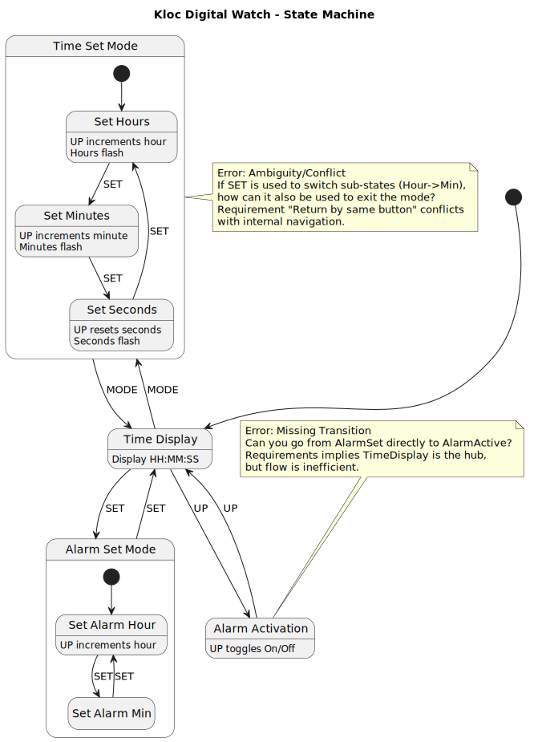

# Applied Practice: Kloc Digital Watch

## Instructions

**Context:** This exercise is based on the "Kloc Digital Watch" case study (Slide 35 in
`1_The_Importance_of_Modeling.pdf`).

**Task:** Draw diagrams representing the digital watch design based on the verbal requirements and identify errors.

**Requirements:**

* Watch has time display (hour, minute, second) and 4 buttons: LIGHT, UP, MODE, SET
* Four modes: time display, time set, alarm set, alarm activation
* MODE enters time set mode, SET enters alarm set mode, UP enters alarm activation
* Return to time display by pressing same button again
* In time set mode: hour flashes first (UP increases), SET switches to minute, SET switches to second
* Alarm set works similarly
* Alarm activation: UP toggles alarm on/off
* LIGHT illuminates display

---

## Solution

### State Machine Diagram

**Source**: [kloc-watch-state.puml](kloc-watch-state.puml)

**Errors Identified:**

1. **Conflict/Contradiction:** The requirement "Return to time display by pressing same button again" conflicts with
   the use of `SET` to navigate inside "Time Set" and "Alarm Set" modes.
2. **Incomplete Specification:** It is undefined what happens if the alarm triggers while the user is modifying the time.
3. **Missing Feature:** No mechanism specified to stop the alarm once it starts ringing (only toggling activation is
   mentioned).
