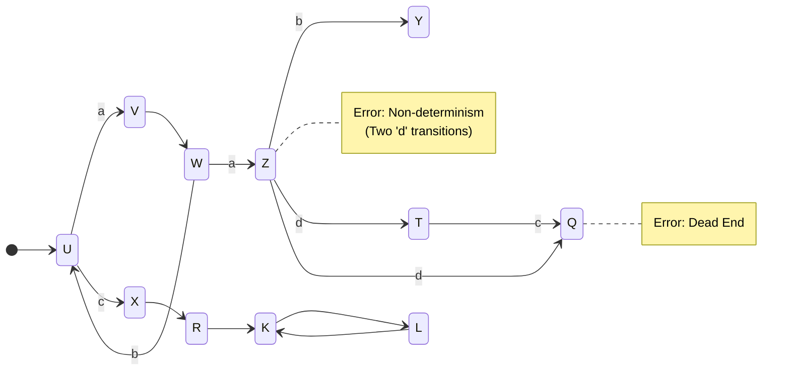

# Applied Practice: Logistics Robotics Quality Check

## Instructions

**Context:** This exercise is based on the "Logistics Robotics" case study (Slide 38 in
`1_The_Importance_of_Modeling.pdf`).

**Scenario:**
A fleet of robots navigates a grid. The navigation logic is modeled as a graph (State Machine).

**Your Task:**
Analyze the provided diagram (Slide 38) and identify **errors that could be detected by an automated tool**.
Look for:

* Unreachable states (Nodes with no incoming arrows from the start)
* Dead ends (Nodes with no outgoing arrows)
* Non-deterministic transitions (Two arrows with the same label from the same node)

## Visualized State Machine

---

## Solution Analysis

**Errors Detected:**

1. **Unreachable State (Node U):**
    * Node `U` has incoming edges from `V` and `W`, but if the start node is the black circle pointing to `U`...
      wait, looking at the diagram `32.pdf`:
    * Start Node points to `U`. So `U` is reachable.
    * *Correction:* Let's trace carefully.
    * `Start -> U -> V -> W`.
    * `W -> U` (Cycle).
    * `W -> Z` (down).
    * `Z -> Y` or `Z -> T`.
    * `X`: Incoming from `U`? No. `U` has `c` to `X`? Yes.
    * **Dead End (Node Q):** Node `Q` has an incoming edge `c` from `T` and `d` from `Z`? (Hard to see specific
      labels without zooming, but `Q` appears to have NO outgoing edges). *Error: Robot gets stuck at Q.*
    * **Infinite Sink/Trap:** If `Q` is a dead end, it's a sink.
    * **Unreachable Nodes?** check `K` and `L`.
        * `K` has incoming from `R` and `L`.
        * `L` has incoming from `K`.
        * `R` has incoming from `X`.
        * So `Start -> U -> X -> R -> K <-> L`. They seem reachable.
    * **Non-Determinism:** Check outgoing edges.
        * Node `U`: `a` to `V`, `c` to `X`. (Distinct labels? If labels are inputs, and input is `a`, it goes
          to `V`. If `c`, to `X`. OK).
        * Node `W`: `b` to `U`, `a` to `Z`. (OK).
        * Node `Z`: `b` to `Y`, `d` to `T`, `d` to `Q`?
            * **CRITICAL ERROR:** Node `Z` has TWO outgoing arrows labeled `d` (one to `T`, one to `Q`? Or
              maybe `W`?).
            * If `Z` has two `d` arrows, the robot doesn't know where to go on input `d`. This is
              **Non-Determinism**.

**Summary of likely Tool-Detectable Errors:**

1. **Non-Determinism:** Duplicate transition labels from the same state.
2. **Deadlocks/Sinks:** States with no exit (if `Q` has no exit).
3. **Unreachable States:** (If any exist based on full tracing).
