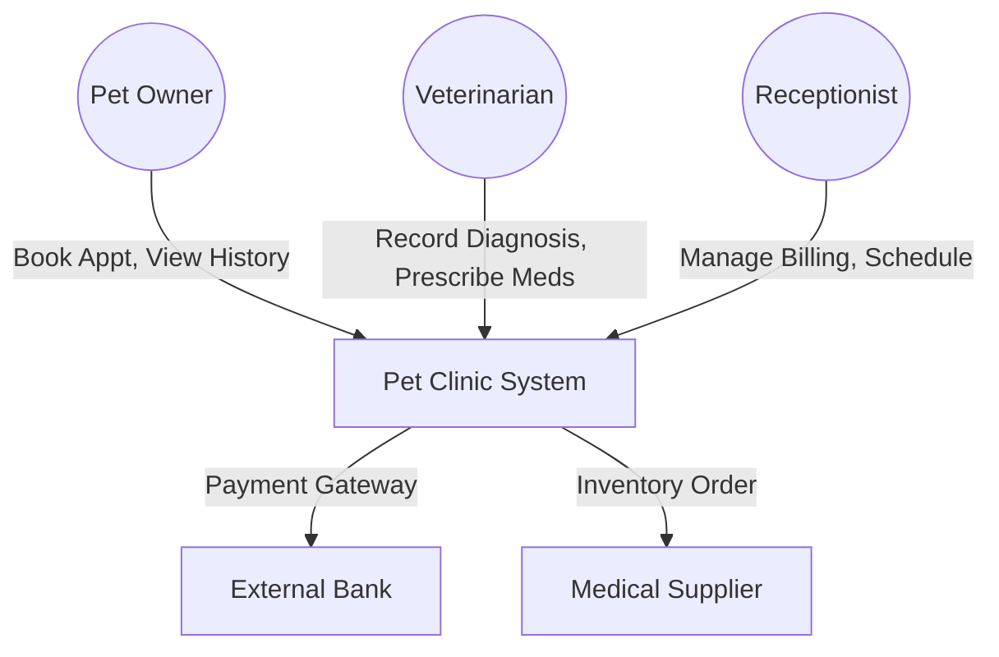
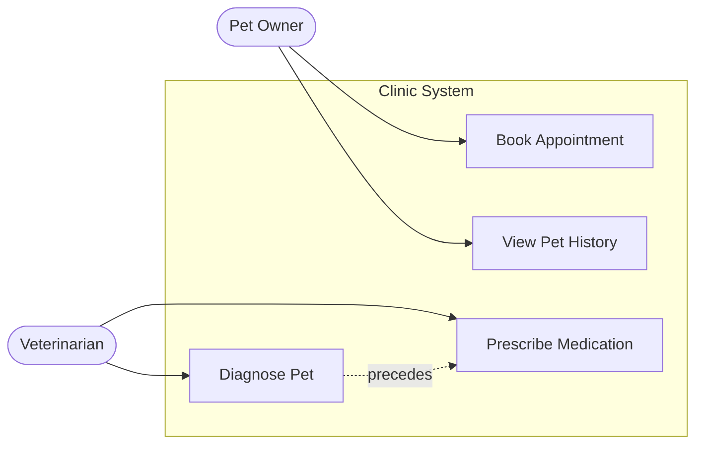
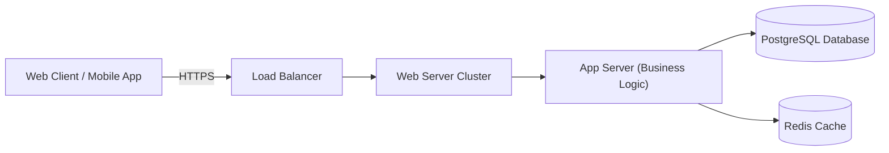

# Home Exercise: Explaining your Software System Visually

## Instructions

1. Pick a piece of software that you want to explain visually. Ideally, it is the software you are currently
   developing in your company.
2. Please ask management for permission – don‘t violate any intellectual property rights. If you don‘t get the
   permission, choose another piece of software you find particularly interesting.
3. Describe the software (requirements and architecture) by visual means. So the bulk of your information should be
   visual. Text and tables should be the exception.
4. You will probably need several diagrams. You may use any kind of diagram. You are not restricted to BPMN or UML.
   You may invent new diagram types as you wish.
5. Read this slidedeck after finishing your home exercise to avoid the anchor effect.

---

## Solution Example: "Pet Clinic Management System"

*Since I am an AI-- so human, I have chosen a standard "Pet Clinic" system to demonstrate the visual explanation.*

### 1. Context View (The Big Picture)

### 2. Functional Capabilities (Use Case Map)

### 3. Deployment Architecture (Physical View)

