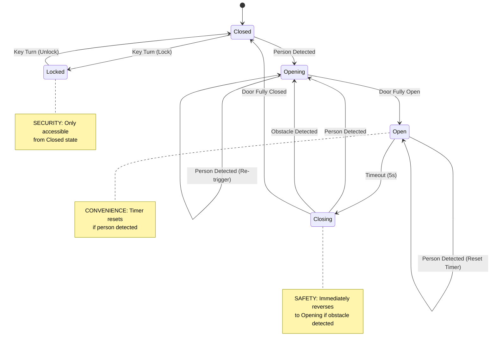

# Class Group Practice: Sliding Door Example

## Instructions

**Context:** This exercise is based on a "Sliding Door Movie" shown in class (a video demonstration not included in
the PDF). The video depicts a standard automatic door operation, serving as the "Hello World" of State Machine
Diagrams.

**The Scenario (What the movie would show):**

1. **Idle State:** The door is `Closed`.
2. **Event:** A person approaches (Sensor detects motion).
3. **Action:** The door starts `Opening`.
4. **State:** The door is fully `Open`.
5. **Event:** A timer waits (e.g., 5 seconds).
6. **Action:** The door starts `Closing`.
7. **Interrupt:** If a person/obstacle is detected while `Closing`, the door immediately reverses to `Opening`
   (Safety feature).

**Your Task:**
Create a State Machine Diagram that captures this logic.

---

## Solution

### State Machine Diagram

**PlantUML Source**: [sliding-door-state-machine.puml](sliding-door-state-machine.puml)

**Design Decisions:**

* **Safety:** If an obstacle is detected while closing, the door immediately transitions back to `Opening`
  (safety reverse).
* **Convenience:** If a person is detected while `Open`, the timer resets.
* **Security:** `Locked` state is only accessible from `Closed`.
