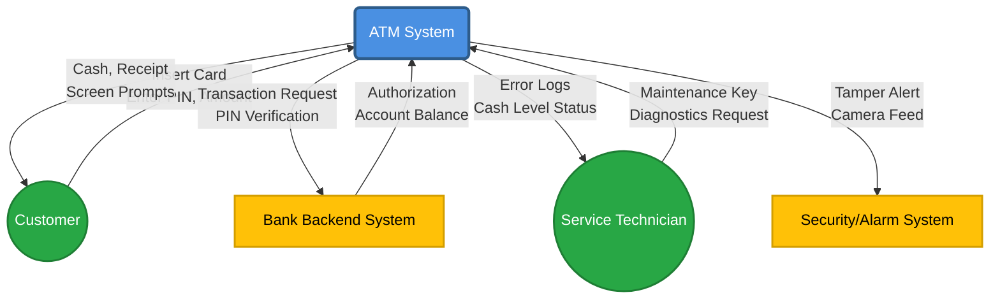

# Applied Practice: ATM Context Diagram

## Instructions

Create a context diagram for an ATM system. Identify all external entities and data flows.

---

## Solution

### Context Diagram (Mermaid)

**Analysis:**

* **System:** The ATM itself.
* **Actors:** Customer, Bank Backend (External System), Service Technician, Security System.
* **Flows:** Financial transaction data, authentication data, physical items (cash/card), and operational status data.
