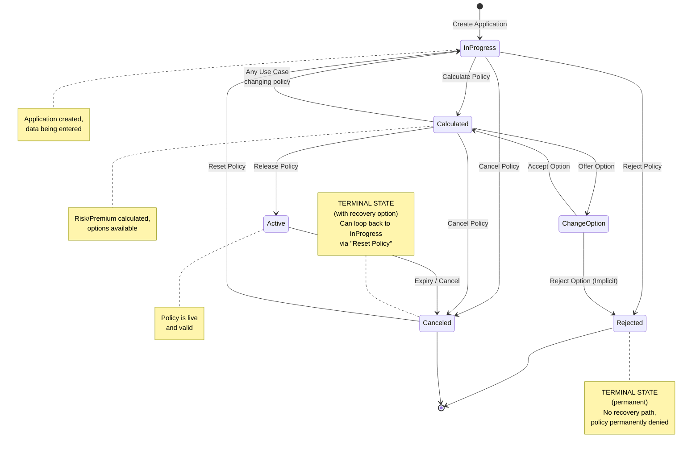

# Exercise: Insurance Policy Lifecycle

## Instructions

Model the lifecycle of an "Insurance Policy" based on the real-world example shown in class.

**Key Concept:**
This example demonstrates **A-States (Application/Business States)**. The transitions are triggered by high-level
Use Cases (e.g., "Create Application", "Accept Option"), ensuring consistency between the Use Case Model and the
State Machine.

**States to Model:**

* **In Progress:** Application created, data being entered.
* **Calculated:** Risk/Premium calculated, options available.
* **Change Option Pending:** Waiting for user to select a new option.
* **Active:** Policy is live and valid.
* **Canceled:** Policy terminated.
* **Rejected:** Application denied.

---

## Solution

### Insurance Policy State Machine

**PlantUML Source**: [insurance-policy-state.puml](insurance-policy-state.puml)
