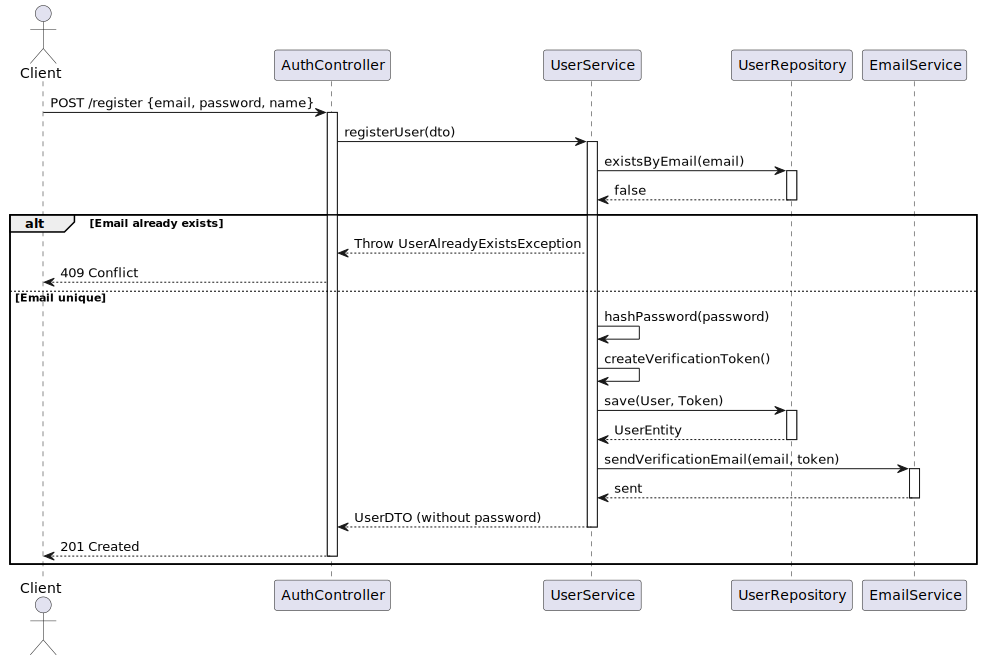
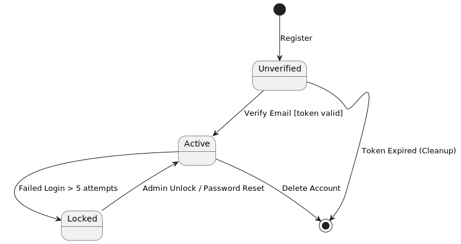

# Exercise 4: AI Generation Preparation

## Instructions

Choose a simple feature (e.g., user registration). Create a model complete enough for AI to generate code:

* Class diagram with all attributes
* Sequence diagram for registration flow
* State machine for user account
* Textual requirements as annotations

---

## Solution

### 1. Textual Requirements & Metainformation

* **Constraint:** Email must be unique in the system.
* **Constraint:** Password must be at least 8 characters, 1 uppercase, 1 special char.
* **Flow:** User cannot log in until email is verified via token.
* **Security:** Passwords must never be stored in plain text; use BCrypt hashing.

### 2. Class Diagram (Domain Model)

**Source**: [user-domain-model.puml](user-domain-model.puml)

### 3. Sequence Diagram (Registration Flow)

**Source**: [user-registration-sequence.puml](user-registration-sequence.puml)

### 4. State Machine (User Account)

**Source**: [user-account-state.puml](user-account-state.puml)
