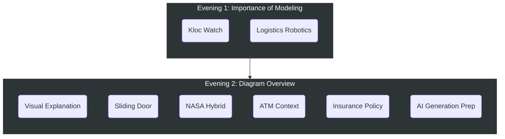

# Advanced Modeling Coursework

This repository contains my exercise solutions, personal notes, and interpretations based on the
**Advanced Modeling** lectures by **Dr. Martin Hasitschka**. I maintain this collection as a
self-study guide and reference for the key concepts covered in the class.

---

## Documentation

| Resource | Audience | Purpose |
| :--- | :--- | :--- |
| [**Field Guide**](ModelingForHumans.md) | Developers | Practical application, C4 model, and quality assessment. |
| [**Ontology**](ModelingForAI.md) | AI Agents | Formal metamodels, validation rules, and code generation targets. |

---

## Course Philosophy

This repository tracks the **Advanced Modeling** curriculum, contrasting customary UML courses by
focusing on the interconnection of modeling methods with software engineering.

> [!IMPORTANT]
> **Learning Outcomes**
>
> * **Develop** static and dynamic models for complex systems.
> * **Assess** model quality using formal and pragmatic criteria.
> * **Design** custom modeling methods tailored to project needs.

---

## Curriculum Map

---

## Exercise Catalog

### Evening 1: The Importance of Modeling

*Foundational concepts, cost of errors, and quality assurance.*

| Exercise Name | Type | Source | Description |
| :--- | :---: | :--- | :--- |
| [Kloc Watch][kloc-ex] | Practice | [Slide 35][kloc-slide] | Detect specification errors in a digital watch interface design. |
| [Logistics][logistics-ex] | Practice | [Slide 38][logistics-slide] | Identify tool-detectable errors (deadlocks, non-determinism). |

### Evening 2: Diagram Overview

*Structure, Behavior, and Integration.*

| Exercise Name | Type | Source | Description |
| :--- | :---: | :--- | :--- |
| [Visual Explanation][visual-ex] | **Official** | [Slide 2][visual-slide] | Visualize a software system without using text. |
| [Sliding Door][door-ex] | **Official** | [Slide][door-slide] | Model a safety-critical automatic door using a State Machine. |
| [NASA Hybrid][nasa-ex] | **Official** | [Slide 84][nasa-slide] | Analyze a real-world NASA diagram (Process + Deployment). |
| [ATM Context][atm-ex] | Practice | [Slide 39][atm-slide] | Define system boundaries and external actors for an ATM. |
| [Insurance Policy][ins-ex] | Practice | [Slide 78][ins-slide] | Model the A-States (Business Lifecycle) of an insurance policy. |
| [AI Generation][ai-ex] | Practice | [Ref: Slide 58][ai-slide] | Create a rigorous, AI-ready model for code generation. |
| [Smart Home][home-ex] | Practice | *Derived* | Combine structure and behavior with heatmap annotations. |
| [Class Diagram Check][class-ex] | Practice | [Slide 47-48][class-slide] | "True/False" quiz on Class Diagram syntax and semantics. |

---

## Toolchain

* **Diagramming:** PlantUML, Mermaid, Draw.io
* **Methodologies:** UML, BPMN, C4 Model
* **Process:** Model-Driven Development (MDD)

## Recommended Reading

* **[The C4 Model](https://c4model.com)** – Simon Brown's approach to software architecture.
* **[OMG Whitepapers](https://www.omg.org/news/whitepapers/index.htm)** – Technical standards and industry trends.

<!-- Link Definitions -->
[kloc-ex]: 1_Evening%201%20The%20Importance%20of%20Modeling/01-kloc-digital-watch/
[kloc-slide]: 1_Evening%201%20The%20Importance%20of%20Modeling/01-kloc-digital-watch/slides/kloc_watch_slides.pdf
[logistics-ex]: 1_Evening%201%20The%20Importance%20of%20Modeling/02-logistics-robotics-quality-check/
[logistics-slide]: 1_Evening%201%20The%20Importance%20of%20Modeling/02-logistics-robotics-quality-check/slides/robotics_slide.pdf
[visual-ex]: 2_Evening%202%20Diagram%20Overview/01-home-exercise-explaining-visually/
[visual-slide]: 2_Evening%202%20Diagram%20Overview/01-home-exercise-explaining-visually/slides/visual_explanation_slide.png
[door-ex]: 2_Evening%202%20Diagram%20Overview/02-class-practice-sliding-door/
[door-slide]: 2_Evening%202%20Diagram%20Overview/02-class-practice-sliding-door/slides/sliding_door_slide.png
[nasa-ex]: 2_Evening%202%20Diagram%20Overview/03-nasa-hybrid-diagrams/
[nasa-slide]: 2_Evening%202%20Diagram%20Overview/03-nasa-hybrid-diagrams/slides/nasa_hybrid_slide.pdf
[atm-ex]: 2_Evening%202%20Diagram%20Overview/04-atm-context-diagram/
[atm-slide]: 2_Evening%202%20Diagram%20Overview/04-atm-context-diagram/slides/context_diagram_slide.pdf
[ins-ex]: 2_Evening%202%20Diagram%20Overview/05-insurance-policy-lifecycle/
[ins-slide]: 2_Evening%202%20Diagram%20Overview/05-insurance-policy-lifecycle/slides/insurance_policy_slide.pdf
[ai-ex]: 2_Evening%202%20Diagram%20Overview/06-ai-generation-prep/
[ai-slide]: 2_Evening%202%20Diagram%20Overview/06-ai-generation-prep/slides/ai_generation_slide.pdf
[home-ex]: 2_Evening%202%20Diagram%20Overview/07-smart-home-hybrid/
[class-ex]: 2_Evening%202%20Diagram%20Overview/08-class-diagram-self-check/
[class-slide]: 2_Evening%202%20Diagram%20Overview/08-class-diagram-self-check/slides/question_slide.pdf
