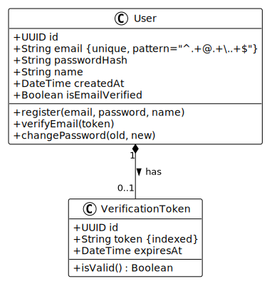

# UML Diagrams

This directory contains PlantUML diagram source files and their auto-generated SVG images.

## Usage

When you commit or push `.puml` files, GitHub Actions will automatically generate corresponding `.svg` files in
the same directory.

## Example: User Authentication System

### Class Diagram (Domain Model)

The domain model shows the core entities and their relationships in the user authentication system.



**Source**: [user-class-diagram.puml](user-class-diagram.puml)

### Sequence Diagram (Registration Flow)

This sequence diagram illustrates the complete user registration process, including validation, token generation,
and email verification.


**Source**: [user-registration-sequence.puml](user-registration-sequence.puml)

### State Machine (User Account Lifecycle)

The state machine represents the different states a user account can be in and the transitions between them.


**Source**: [user-account-state.puml](user-account-state.puml)

---

## How to Add New Diagrams

1. Create a new `.puml` file in this directory
2. Add your PlantUML code between `@startuml` and `@enduml` tags
3. Commit and push the file
4. GitHub Actions will automatically generate the `.svg` file
5. Reference the diagram in your markdown:

   ```markdown
   
   ```

## Editing Diagrams

1. Edit the `.puml` source file (not the `.svg`)
2. Commit and push your changes
3. The `.svg` will be automatically regenerated

## Local Testing

To preview diagrams locally, you can:

- Use the PlantUML extension in VS Code
- Use IntelliJ IDEA's PlantUML plugin
- Run PlantUML CLI: `plantuml diagrams/*.puml`
